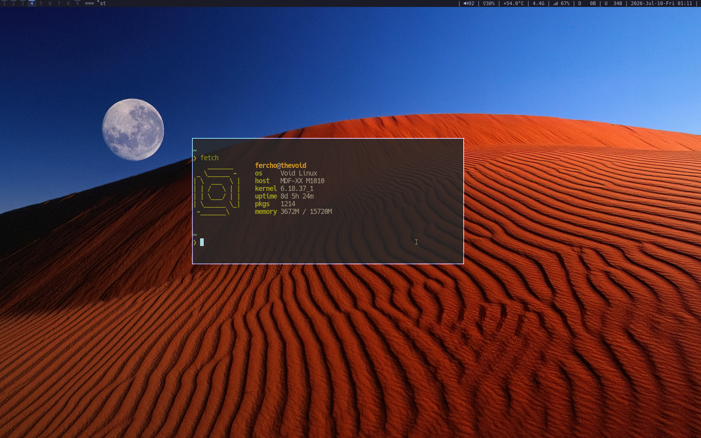

# Readme
My personal configuration files for my linux rice.



## Install

```
git clone https://github.com/fercho3773/dotfiles.git
mkdir -p ~/dotfiles
cd ~/dotfiles
chmod +x install.sh
./install.sh
```
You may also want to `chmod +x ~/.local/bin/*`.

## Components
| Directory  | about  |
|---|---|
| bin  | Symbolic link to ~/.local/bin for executable files  |
| dunst | Notification daemon   |
| nvim  | Text editor (neovim ) |
| tmux  | Terminal multiplexer  |
