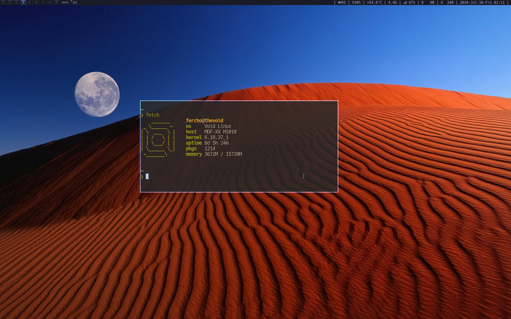

# Readme
My personal configuration files for my linux rice.



## Install

```
git clone https://github.com/fercho3773/dotfiles.git
mkdir -p ~/dotfiles
cd ~/dotfiles
chmod +x install.sh
./install.sh
```
You may also want to `chmod +x ~/.local/bin/*`.

## Components
### Directories
| Directory  | about  |
|---|---|
| bin  | Symbolic link to ~/.local/bin for executable files  |
| feh | Image viewer |
| dunst | Notification daemon   |
| mpv  | Multimedia viewer |
| nvim  | Text editor (neovim ) |
| tmux  | Terminal multiplexer  |
| zathura | Minimalist document viewer |
| zsh | Files sourced by `.zshrc` |

### Scripts
to do

### Single Files
| File | about |
| --- | --- |
| install.sh | Shell script to install the files using symbolic links.  |
| starship.toml | Shell prompt customization |
| .Xresources | Customization for x11. |
| .xinitrc | File used to start x11 window managers using `startx`. |
| .zshrc | Configuration file for the Z shell. |

